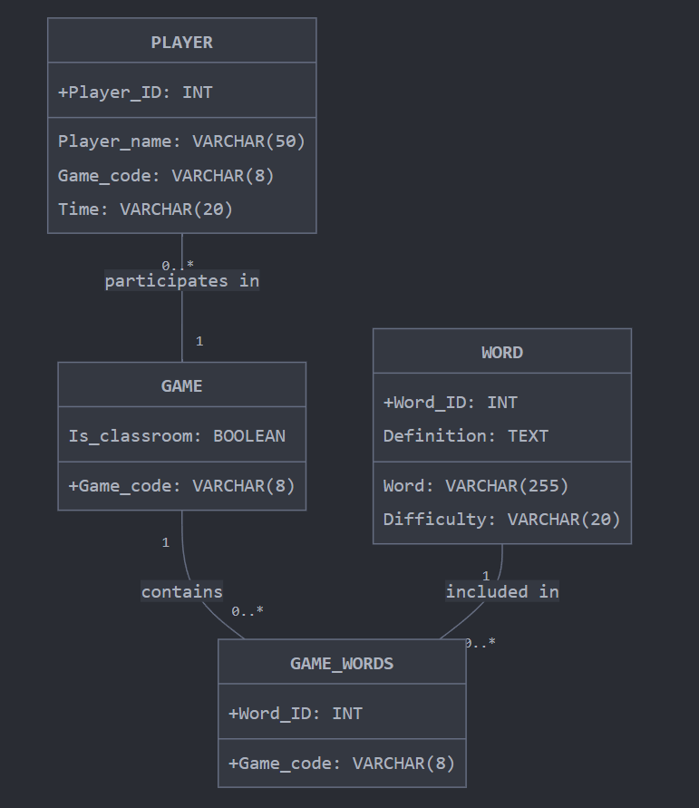

30 second pitch link: https://youtu.be/4J_v8ajRfRA

Longer video link: https://www.youtube.com/watch?v=AuhUiFYnn-M

# Documentation

## Members of the Team
* Mattheus S. (Team Lead, DVT Lead)
* Sophie B. (Team Lead, DST Lead)
* Willem V Z. (DVT)
* Evan G. (DST)
* Noah D. (DVT)
* Alex L. (DVT)
* Huston G. (DVT)
* HY W. (DST)
* Jared M. (DST)
* VJ G. (DST)
  
For the sake of this document, *'DVT'* stands for Development Team, and *'DST'* stands for Design Team

## Intended Use
The target audience for this website are elementary school students and teachers. This website was created in order to encourage the growth of vocabulary, spelling, and decision making skills. With this being said, a website of this manner can theoretically be used for any subject in any class at any age level. 

## Game Overview
The goal of the game is to type given words correctly as fast as possible. This is a timed game. 

This game can be played in single or multiplayer.

At the start of the game, each user is prompted with the definition of a word. The user is also prompted with the letters of the given word in a random order. Ex. If the word is 'School', you will be shown something like 'lohcoS' along with 'Definition: A place where students study'. 

When the user types in the correct word into the input box, they can either hit the enter button, or click the submit button to submit their answer. Then, the next prompt appears. 

If the word is too hard to unscramble, the user will have the option of clicking the hint button. Every time the hint button is clicked, a letter will fall into its correct place. Simultaneously, 3 seconds will be added to your timer as a penalty. 

At the end of the game, the user will be taken to a leaderboard where the total time it took the player to unscramble all of the words. The person with the lowest time will be on the top. 

## Teacher Overview 
On this website teachers will be able to create classroom games for their students. The website allows you to create a game which generates a game code with it. Students can then join this game with their other classmates and compete with each other. 

Teachers will be able to either specify how many words along with the difficulty of the game, or will be able to crete a game using their own file of words. 

Teachers will also be able to practice their own words by joining a game that they themselves created! 

The .csv file must be in the format: 
* **Word**, **Definition**
* Dog, A brown, fuzzy, house pet
* Polyatomic Ion, A covalent bonded set of two or more atoms, or of a metal complex, with net charge of not 0
* せんせい, Teacher

The teacher can also play single player games with words pregenerated by the website's database. 

## Student Overview 
On this website, students will be able to either join classroom games, or play in a single player game.

If the teacher creates a game code, the student will then click the 'Join Game' button, and type in the game code that the teacher had generated. The student will also have to type in a username. The student will not be able to join the game without a username. 

The student will then immediately be entered into the game. Right when they enter the game, their **Time will start**. 

When all of the words are correctly typed, they will be placed into a leaderboard based on how long it took them to complete the game. The less time it takes someone, the higher on the leaderboard they will place. 

## Design

### UML Diagram

### Web Pages
The website's [HTML pages](./templates/) connect to the  [Flask server](./app.py) in order for the DT to gather user input from the website. The website also includes CSS, where the styling of the text is sourced from ['.ttf' files](./assets/font/), and the [background images](./static/) are AI generated. There will also be [music](./assets/music/) playing on each page of the website. 

There are 6 HTML pages
1. [Home](#homehtml)
2. [CreateClassroom](#createclassroomhtml)
3. [JoinGame](#joingamehtml)
4. [SinglePlayerSettings](#singleplayersettingshtml)
5. [Game](#gamehtml)
6. [Leaderboard](#leaderboardhtml)

#### Home.html 
Is found [here](./templates/Home.html)

The home page will have three options. You can either 'Create a Game', 'Join a Game', or 'Play'. 

Creating a game will allow you to generate a game code in order for other people to join. 

Joining a game requires a username and a game code in order to start playing 

The 'Play' button allows the user to play in Single Player mode. Here, you can choose how many words you want to unscramble, and the dificulty of the words that you are unscrambling. 

#### CreateClassroom.html 
Is found [here](./templates/CreateClassroom.html)

The CreateClassroom page will allow teachers to create a game code in order to start a game for their students. This page will have two main options for the starting of the game. The teacher can either [create a file](#teacher-overview) and use the words that they've created for their students, or use default words from the website. The default words were generated using Genesis AI.

If the teacher chooses to create a game file and use it, all other input options will be nullified.

If the teacher decides not to create their own game file, the the game will run off of the pregenerated data in the website. The teacher will then have the options of choosing how many words the students will have to solve, and will have the option of choosing the level of diffulty the game will be. The different options of difficulty are 1st-5th grade. 

#### JoinGame.html 
Is found [here](./templates/JoinGame.html)

The JoinGame page will ask users to input a game code that has been created from the [CreateClassroom page](#createclassroomhtml). These students will then be immediately taken into the Game.html page. 

#### SinglePlayerSettings.html 
Is found [here](./templates/SinglePlayerSettings.html)

THe SinglePlayerSettings page is shown after a user clicks on the 'Play' button in the [Home page](#homehtml). This page allows users to edit the settings for the single player game which they're about to play. Similar to the CreateClassroom page, the user will be asked to specify how many words they would like to solve, and at what difficulty they would like the words to be at. The options of difficulty are from 1st - 5th grade. 

#### Game.html 
Is found [here](./templates/Game.html)

This page is where the magic happens. You are shown a description of the word, and must unscramble the letters on the right hand side of teh screen in order to find sed word. Once the word is thought of, typing it into the input box and clicking submit will move you onto the next word to solve. 

As an added bonus, when you click the 'enter' button, your word will automatically be submitted. Similarly, when clicking the 'tab' button, a hint will automatically be generated on teh screen as well. 

This page also shows how many words are remaining in the game to solve, and shows you how much time you've spent on the game so far. The timer will start at 0:00, and will increase over time. 

#### Leaderboard.html 
Is found [here](./templates/leaderboard.html)

This page in intended to show a leaderboard of the fastest times taken to solve the game within a given classroom or single player setting. For example, for those who played single player with a difficulty of 'grade level 1' solving 20 word will be placed in a different leaderboard than those who played in a game of 'grade level 2' solving 20 words. Likewise, every given classroom game will have their own respective leaderboards which will be deleted when the game is over. 

### mySQL Database
The creation of the [mySQL](./create_database/creationQuerries.py) database is important for the structuring and maintaining of the data that is created both during and after games. By putting our data into a mySQL database, our website will be able to maintain high traffic in a more efficient manner, for example with sharding. 

*Note: we don't have this implemented, but because we chose to use sql, it is an option for the future of the project*

In this database, we want to have a large table for single player games where when each person completes a higher score than someone else globally, it will show up on the leaderboard. In this way, there will always be something to compete for. With this being said, there was an idea that we had where we would only keep the top 10 scores of all time in the database per game settings which would save us a lot of space. 

We will also have a seperate databse for each classroom game that occurs for the final leaderboard, and will display the top 3 fastest times at the end of the game. Instead of Keeping all of the data, we would discard it and only keep the three fastest to showcase at the end. **This is not implemented yet, it's in progress**. After the classroom database game ends, we delete the database to save space. This also accounts for the off chance that the same game code is generated in the future in a completely seperate game. 

## Future Work
* The hint button should be working with the 'tab' hotkey
* Create different word databases for different classes in different grades. Maybe for certain college courses
* Create different word databases for learning languages
* Make a better UI for teachers to be able to add their own words and definitions to a file
* Containerize the application, change all handset keys and passwords so that other people can use the code too
* Organize the rest of our files into folders properly
* Change backgrounds into possibly animated pictures
* Create slots in Game.html for the unscrambled word so that when clicking the hint button, a letter falls into place
* Possibly animate our mascots
* Delete and end game session after all students in game have finished
 
## Assumptions
* The user follows the [README](./README.md) before running the program.
* The user is technically competent - can create a file, knows how to upload a file, knows how to name a file '.csv'
* The user does not change the files, file names, nor the location of prexisting files.
* The user's files do not include images, special characters, double spaces, etc.
* The user does not click on the 'back button' on the top right of the screen after completing the game.
* Does not use more than approximately 4 users at a time for now, this somehow breaks everything
* The user does not reenter a previously used game code into the JoinGame.html page, unless a NEW game code was created and it so happened to be the exact same as the last one that was created.

## Works Cited
